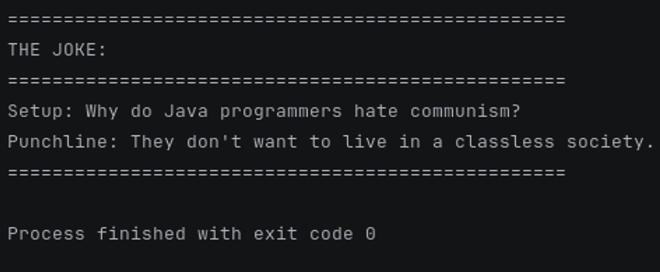

# API Homework - JokeAPI

## Description
This Python program calls the JokeAPI to retrieve random programming jokes.

## API Information
- **API Used:** JokeAPI
- **API Endpoint:** https://v2.jokeapi.dev/joke/Programming
- **Access Method:** GET request (no authentication required)
- **Documentation:** https://v2.jokeapi.dev/

## How It Works
The program makes a GET request to the JokeAPI, retrieves a random programming joke, and displays it in a formatted output. It includes error handling for timeouts and request failures.

## Requirements
- Python 3.x
- requests library

## Installation
```bash
pip install requests
```

## Usage
Run the program:
```bash
python joke_api.py
```

## Sample Output
See screenshot below:


## What I Learned
- How to make GET requests using the requests library
- How to handle JSON responses from APIs
- How to implement error handling with try-except blocks
- How to work with API documentation